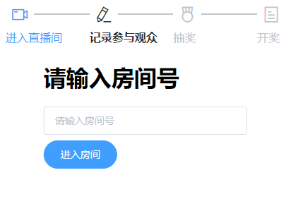

# Bilibili Live Lottery

Bilibili直播弹幕抽奖

## :bookmark_tabs:内容列表

- [背景](#背景)
- [安装](#安装)
- [使用说明](#使用说明)
- [使用许可](#使用许可)

## :triangular_flag_on_post:背景

许多主播在直播抽奖时都是通过截图来抽奖的，而我从没中过，想来想去越想越气，这肯定是因为截图这种方法不公平！

于是就有了这个项目……

(然而我还是没中过)

## :hourglass:安装

不需要安装~

就简单地用 [mdui](https://mdui.org/) 随便写了写，所有依赖都在 [libs](libs/) 文件夹中。

浏览器打开 [main.html](main.html) 即开即用:+1:

## :bell:使用说明

1. 输入房间号后点击 `点击开始` 按钮开始记录发送弹幕的用户 uid 和昵称，不会重复记录。
2. 点击 `停止记录` 按钮后停止记录发送的弹幕。
3. 点击 `随机抽奖` 按钮在刚才记录过程中所有发送弹幕的用户里面随机抽取一位。
4. 关闭弹窗后点击中间粉色的中奖用户用户名可跳转到该用户的B站主页方便私信。

## :page_with_curl:使用许可

[WTFPL](LICENSE) :copyright: kdxcxs